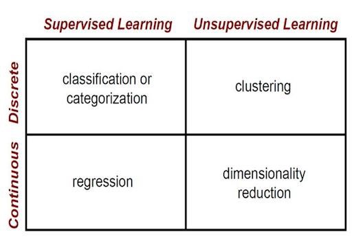

# Intro - Machine Learning 

> This repository is for people starting with machine learning with **Python** trying to understand the basic mathematics. In this particular repository you can find the tutorials from **[sentdex](https://www.youtube.com/user/sentdex)**
> **Jupyter Notebooks** allow you to play with training data (Quandl etc.), different algorithm configurations and see results on the fly directly in **your browser**.
> Resources will be given at the very bottom of this document!

The purpose of this repository is to give you a holistic understanding of the machine learning concepts

## TLDR



The main difference between the two types is that supervised learning is done using a so called **ground truth** 
which means we have prior knowledge of what the output values for our samples should be. 

The goal of supervised learning is to learn a function that, given a sample of data and 
desired outputs, best approximates the relationship between input and output observable in the data. 

Unsupervised learning, on the other hand, does not have labeled outputs, so its goal is to infer the 
natural structure present within a set of data points.

## Supervised Learning

In supervised learning we have a set of training data as an input and a set of labels or "correct answers" for each training set as an output. 
Then we're training our model (machine learning algorithm parameters) to map the input to the output correctly (to do correct prediction). 
The ultimate purpose is to find such model parameters that will successfully continue correct input→output mapping (predictions) even for new input examples.

### Regression

In regression problems we do real value predictions. Basically we try to draw a line/plane/n-dimensional plane along the training examples.

_Usage examples: stock price forecast, sales analysis, dependency of any number, etc._

#### 🚀 Linear Regression

- 📗 [Math | Linear Regression](Projects/Linear_Regression) - theory and links for further readings
- 💻 [Code | Linear Regression](Projects/Linear_Regression/https://github.com/jousefm/Machine-Learning-Sentdex/blob/master/Intro.ipynb) - implementation example from **[sentdex](https://www.youtube.com/user/sentdex)**


### Classification

In classification problems we split input examples by certain characteristic.

_Usage examples: spam-filters, language detection, finding similar documents, handwritten letters recognition, etc._

#### 🚀 Logistic Regression

```bash
TO-DO
```

## Unsupervised Learning

Unsupervised learning is a branch of machine learning that learns from test data that has not been labeled, classified or categorized. 
Instead of responding to feedback, unsupervised learning identifies commonalities in the data and reacts based on the presence or 
absence of such commonalities in each new piece of data.

### Clustering

In clustering problems we split the training examples by unknown characteristics. The algorithm itself decides what characteristic to use for splitting.

_Usage examples: market segmentation, social networks analysis, organize computing clusters, astronomical data analysis, image compression, etc._

#### 🚀 K-means Algorithm

```bash
TO-DO
```

### Anomaly Detection

Anomaly detection (also outlier detection) is the identification of rare items, events or observations which raise suspicions by differing significantly from the majority of the data.

_Usage examples: intrusion detection, fraud detection, system health monitoring, removing anomalous data from the dataset etc._

#### 🚀 Anomaly Detection using Gaussian Distribution

```bash
TO-DO
```

## Neural Network (NN)

The neural network itself isn't an algorithm, but rather a framework for many different machine learning algorithms to work together and process complex data inputs.

_Usage examples: as a substitute of all other algorithms in general, image recognition, voice recognition, image processing (applying specific style), language translation, etc._

#### 🚀 Multilayer Perceptron (MLP)

```bash
TO-DO
```

## Machine Learning Map


## Prerequisites

#### Installing Python

Make sure that you have **[Python installed](https://realpython.com/installing-python/)** on your machine. You can check your Python version by running:

```bash
python --version
```

You might want to use **[venv](https://docs.python.org/3/library/venv.html)** standard Python library
to create virtual environments and have Python, `pip` and all dependent packages to be installed and 
served from the local project directory to avoid messing with system wide packages and their 
versions.

#### Installing Dependencies

Install all dependencies that are required for the project by running:

```bash
pip install -r requirements.txt
```

#### Launching Jupyter Locally

You can run all projects by installing Jupyter locally. But if you want to launch **[Jupyter Notebook](http://jupyter.org/)** locally you simply type in the following command into the terminal:

```bash
jupyter notebook
```
After this Jupyter Notebook will be accessible by `http://localhost:8888`.

## Datasets

The list of datasets that is being used for Jupyter Notebook demos may be found in **[data folder](Data)**.


## Shoutout

Design of this repository inspired by [Oleksii Trekhleb](https://github.com/trekhleb)